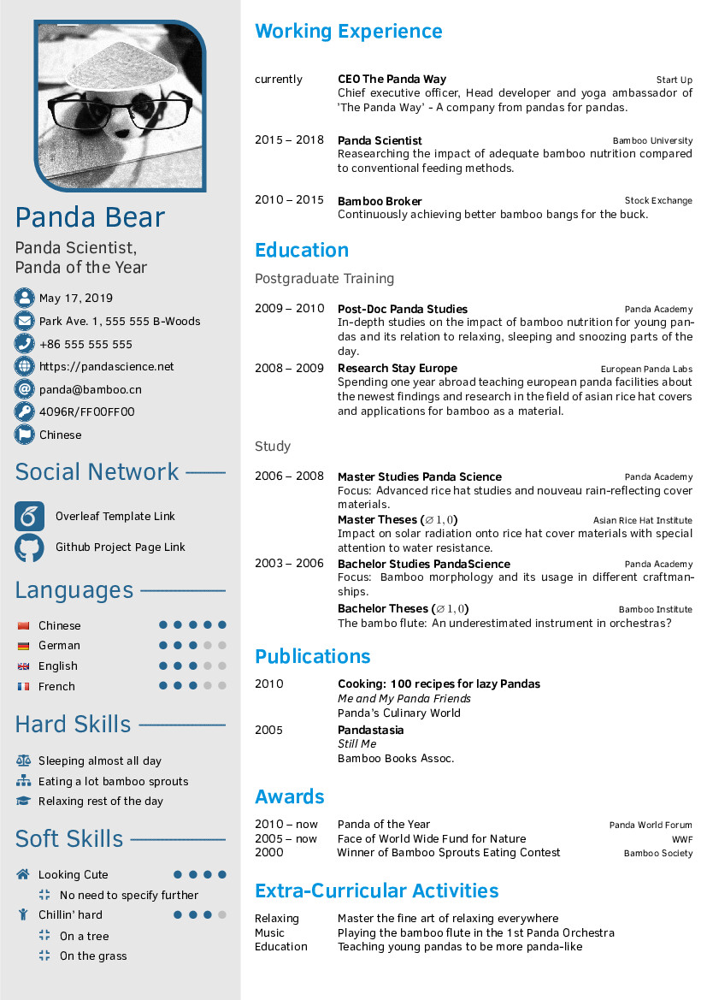
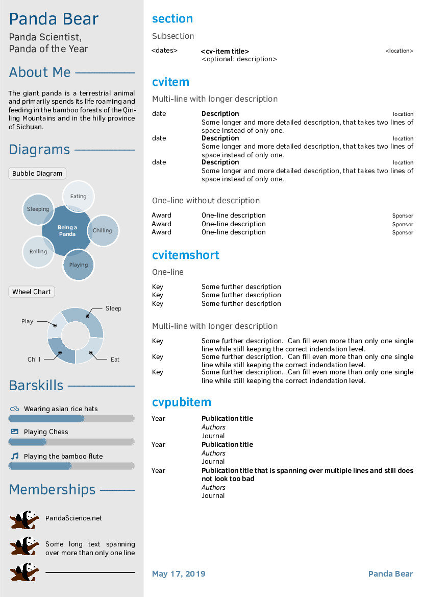

Forty Seconds CV
================

## Description

Just another CV class for LaTeX - but this time highly customizable!

This project can be regarded as a major rewrite of the original twentysecondcv
class. It does not aim to provide a new CV style that you can't find anywhere
else, but rather takes a very well established one and adds a straightforward
user interface to almost all layout elements and thus creates a highly 
customizable framework-class: FortySecondsCV.

Just try it yourself starting from `template.tex`!

When you should use twentysecondcv or altacv or any other LaTeX CV class:

* You are happy with the layout elements offered by the existing CV class styles
* You don't need to change paper sizes / formats at all
* You don't want to customize your CV further

When you should use the FortySecondsCV class:

* You like to build a CV optimized for 2 pages incl. a sidebar (with option for
  additional pages)
* You want to highly customize your CV using a great palette of colors and
  layout elements
* You don't want to modify any definition in the class file
* You prefer an easy to use user interface to almost all style elements
* You need a cleanly written class file in case you decide to change low-level
  class definitions


## Attributions

* This LaTeX CV class is based on the style ideas of the 
  [twentysecondscv class](https://github.com/spagnuolocarmine/TwentySecondsCurriculumVitae-LaTex)
  by Carmine Spagnuolo 
* Language icons in the template are taken from [gosquared's repository](https://github.com/gosquared/flags)


## Requirements

* You need to compile your document with XeLaTeX in order to have the latest
  Font Awesome icons (`fontawesome5`). If you still want to compile with
  pdfLaTeX for whatever reason, FortySecondsCV will fall back to the older icon
  package (`fontawesome`), where some icons look different and some others are
  not even included.

## User Interface

### Class Options

Possible options that can be passed to FortySecondsCV are:

* all valid options for the standard article class like e.g. `a4paper`
* `showframes` will show frames around the sidebar and body texts that help to
  adjust margins correctly.
* `maincolor=<color>` sets the color that is used for the entire sidebar incl.
  headings, icons and charts. Many colors are derived from it.
* `sectioncolor=<color>` sets the color of section headings in the body text.
* `subsectioncolor=<color>` same as sectioncolor for subsections.
* `sidebarwidth=<length>` sets the total width of the sidebar, i.e. the width
  of the visible sidebar color. 
* `topbottommargin=<length>` sets the top and bottom page margin for both
  columns.
* `leftrightmargin=<length>` sets the left and right page margin for both 
  columns as well as how much space will be between both columns.

Note: 

* Lengths can be specified in any absolute length unit, e.g. `em` for widths, 
  `ex` for heights or relative ones like `0.5\paperheight` or `0.3\linewidth`.
* Colors can be picked from the entire catalogue provided by the `dvipsnames`, 
  `svgnames` and `x11names` options of the `xcolor` package. See 
  [xcolor package documentation](http://mirrors.ctan.org/macros/latex/contrib/xcolor/xcolor.pdf) 
  for details and color tables.

### Sidebar

Sidebars on front and back of the CV are generated using the commands
`\makefrontsidebar` and `\makebacksidebar` within the `document` part of the
LaTeX code. It is recommended to use `\newpage` immediately before
`\makebacksidebar`.

* Layout elements in front and back sidebar can be added either by using
  ```latex
  \addtofrontsidebar{}
  \addtobacksidebar{}
  ```
  where some pre-defined elements like profile picture, name and jobtitle are
  already set, or completely redefine them using
  ```latex
  \renewcommand{\makefrontsidebar}{%
    \begin{sidebar}
      <your code>
    \end{sidebar}
  }
  ```
  * The `sidebar` environment makes sure that all elements will be positioned
    correctly within the left column (sidebar) of each page.
  * Using the `sidebar` environment, you can also add more sidebar definitions 
    for additional pages easily.

* Set personal information via
  ```latex
    % profile picture
    \cvprofilepic{pics/profile.png}
    % your name
    \cvname{Panda Bear}
    % job title/career
    \cvjobtitle{Panda Scientist,\\[0.2em] Panda of the Year}
    % date of birth
    \cvbirthday{Mar 7, 2019}
    % short address/location, use \newline if more than 1 line is required
    \cvaddress{Park Ave.~1, 555 555 B-Woods}
    % phone number
    \cvphone{+86 555 555 555}
    % personal website
    \cvsite{https://pandascience.net}
    % email address
    \cvmail{panda@bamboo.cn}
    % pgp key
    \cvkey{4096R/FF00FF00}{0xAABBCCDDFF00FF00}
    % add additional information
    \newcommand{\additional}{some more?}
  ```
  * The email address will be automatically linked with `mailto:email`.
  * For the pgp key, the first argument defines the displayed text which is
  	linked to a keyserver searching for the ID in the second argument. For
  	safety, you should use your key's long ID or its fingerprint in the second
  	argument.
  * The `\additional` macro shows how to define new lines.

* The personal information table can also be reconfigured completely via 
  ```latex
  \renewcommand{\personaltable}{%
    \begin{personal}[0.8em]
      \circleicon{\faKey}      & \cvkey  \\
      \circleicon{\faAt}       & \cvmail \\
      \circleicon{\faGlobe}    & \cvsite \\
      \circleicon{\faPhone}    & \cvphone \\
      \circleicon{\faEnvelope} & \cvaddress \\
      \circleicon{\faInfo}     & \cvbirthday \\
      % add another line
      \circleicon{\faQuestion} & \additional
    \end{personal}
  }
  ```
  * You can use all predefined macros like `\cvphone` etc. but also define new
    ones as shown above and use them in your own table.
  * The second argument sets the space between icons and corresponding text.

### Further Sidebar Style Elements

* Section heading
  ```latex
  \profilesection{<section title>}
  ```

* Simple skill containing only an icon and some text and with optional
  indentation
  ```latex
  \skill[<indent>]{<icon>}{<text>}
  ```

* Pointskill consisting of an icon, text and number of points with maximum 5.  
  Some examples:
  ```latex
  \pointskill{<icon>}{<text>}{<points>}
  ```
  creates a skill using a Font Awesome icon with some text and a ranking of 3 
  out of 5 points.
  ```latex
  \pointskill{\flag{DE.png}}{German}{5}
  ```
  creates a language skill using a flag-icon, which has to be indicated using
  the `\flag` command in order to inform the class that the icon should not be
  colored in the `\maincolor`.

* Barskill consisting of an icon, text and percentage of how far the skillbar
  should be filled
  ```latex
  \barskill{<icon>}{<text>}{<percentage>} 
  ```
* "About me" text
  ```latex
  \aboutme{<text spanning multiple lines>}
  ```

* Rounded and colored label for e.g. charts and other graphics
  ```latex
  \chartlabe{<text>}
  ```

* Wheel chart
  ```latex
  \wheelchart{<outer radius>}{<inner radius>}{%
    <percentage>/<spacing>/<color>/<text>,
    <percentage>/<spacing>/<color>/<text>
  }
  ```
  * percentages should add up to 100

* Memberships
  ```latex
  \begin{memberships}
    \membership{<logo>}{<text>}
    \membership{<logo>}{<text>}
    \membership{<logo>}{<text>}
  \end{memberships}
  ```


### Body
The right column of the CV containing tables for sth. like "working experience"
has to be defined within the `document` environment.

* Section and subsection headings
  ```latex
  \cvsection
  \subsection
  ```

* CV items should be enclosed by `cvtable`, independent of the item type.
  Possible types are:
  ```latex
  \begin{cvtable}
    \cvitem{<dates>}{<title>}{<location>}{<description>}
    \cvitem{<dates>}{<title>}{<location>}{}
    \cvitemshort{<key>}{<description>}
  \end{cvtable}
  ```
  * `cvitem` including a description will make the title bold, left-align the
    date, right-align the location and put the description indented on the next
    line
  * `cvitem` missing a description will add a one-line item in the style of the
    former one but with a "normal" title instead of a bold one.
  * `cvitemshort` left-aligns `<key>` followed by its description

* Profile picture styles
  ```latex
  \profileroundedcorners
  ```
  is the one visible in the example below
  ```latex
  \profilecircle
  ```
  clipped to a circle as in the original `twentysecondcv` class

* Name and jobtitle combination with proper spacing, font and color
  ```late
  \nameandjob
  ```

* Finalizing the CV with a place, date and signature as common practice in e.g.
  Germany is done via 
  ```latex
  \cvsignature
  ```

### Misc

* Change font either by loading the corresponding package, e.g. for google noto
  font
  ```latex
  \RequirePackage[sfdefault]{noto} % use noto google font
  ```
  or by using XeLaTeX's option to load local fonts directly via fontspec
  ```latex
  \RequirePackage[quiet]{fontspec}
  \newfontfamily\headingfont[Path = fonts/]{segoeuib.ttf}
  ```


## Example



